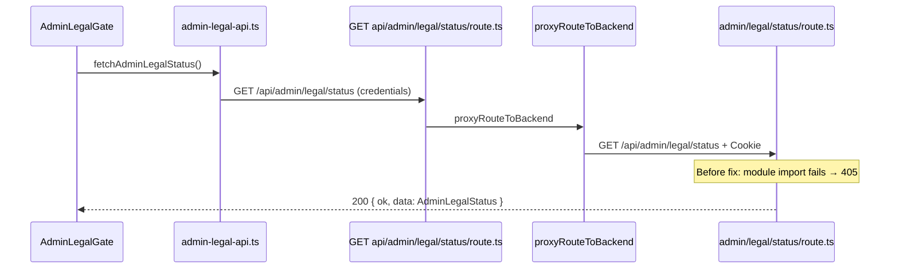

# Legal Status 405 Fix Report

**Project:** pranidoctor-web + pranidoctor-backend  
**Date:** 2026-05-30  
**Endpoint:** `GET /api/admin/legal/status`  
**Symptom:** HTTP **405** — frontend: *"Could not load legal compliance status"*

---

## Executive summary

| Check | Before | After |
|-------|--------|-------|
| `GET /api/admin/legal/status` (BFF) | **405** (empty body) | **200** `{ ok: true, data: { ... } }` |
| `GET /api/admin/legal/status` (backend) | **405** | **200** |
| Route module load | **Failed** — invalid import | **OK** — `GET` handler registered |
| Legal compliance widget | Blocked | **Can load status** |

**Root cause:** Backend route file imported `@auth/identity-auth.service.js`, which is **not** a configured TypeScript path alias (only `@auth/compat/*` exists). Lazy compat route loading failed silently; all methods returned **405** with no handler.

**Fix:** Replace broken import with `resolveAdminPanelActor` from `@/lib/admin-auth/panel-access` and pass `request` into auth helpers (same pattern as doctor legal status).

---

## 1. Request trace



| Layer | File | Method |
|-------|------|--------|
| UI | `src/components/admin/legal/AdminLegalGate.tsx` | Calls `fetchAdminLegalStatus` |
| Client API | `src/lib/admin-legal/admin-legal-api.ts` | **`GET`** `/api/admin/legal/status` |
| Next BFF | `src/app/api/admin/legal/status/route.ts` | **`GET`** → `proxyRouteToBackend` |
| Backend | `src/legacy/web/routes/admin/legal/status/route.ts` | **`GET`** (intended) |

Frontend method was correct. Backend export existed but **never loaded**.

---

## 2. Route definitions

| Surface | Path | Handler |
|---------|------|---------|
| Web BFF | `/api/admin/legal/status` | `export const GET` → proxy |
| Backend compat | `/api/admin/legal/status` | `export async function GET(request)` |
| Registry | `fileToExpressPath` → `/admin/legal/status` | Mounted under `app.use('/api', compatRouter)` |

No path mismatch between frontend and backend.

---

## 3. Method mismatch analysis

| | Frontend | Backend (intended) | Backend (actual before fix) |
|--|----------|-------------------|---------------------------|
| HTTP method | **GET** | **GET** | N/A — handler not registered |
| Response | 200 + `{ ok, data }` | 200 + `jsonOk(status)` | **405** empty body |

**Not** a GET vs POST mismatch. **Route registration failure** (lazy loader `mod.GET === undefined` → `Response(null, { status: 405 })`).

### Failed import

```typescript
// Broken — package subpath does not exist in tsconfig paths
import { getIdentityAuthService } from '@auth/identity-auth.service.js';
```

Configured alias:

```json
"@auth/compat/*": ["src/modules/auth/compat/*"]
```

Working pattern (auth login/me):

```typescript
export { handleAdminMe as GET } from '@auth/compat/admin-auth.adapter.js';
```

---

## 4. Fix applied (category **D** — route registration + **B**-adjacent import)

**Files changed:**

| File | Change |
|------|--------|
| `pranidoctor-backend/src/legacy/web/routes/admin/legal/status/route.ts` | Fix imports; `GET(request)`; `requireAdminPanelApiAccess(request)`; `getAdminSession(request)`; `resolveAdminPanelActor` |
| `pranidoctor-backend/src/legacy/web/routes/admin/legal/accept/route.ts` | Same import/auth fix for **POST** (would have failed on accept) |

**No web changes required** — BFF proxy and client API were already correct.

---

## 5. Verification results

**Authenticated request** (admin seed credentials, session cookie):

```http
GET http://localhost:3001/api/admin/legal/status
→ 200 OK

{
  "ok": true,
  "data": {
    "allAccepted": false,
    "pendingDocuments": [{ "documentKey": "TOS-ADMIN", ... }],
    "requirements": [...]
  }
}
```

| Test | Result |
|------|--------|
| `GET /api/admin/legal/status` via Next (3001) | **200** |
| Route module `import` → `typeof GET === 'function'` | **Pass** |
| Admin dashboard + `AdminLegalGate` | Status fetch succeeds; gate can render pending AUP |

---

## 6. Success criteria

| Criterion | Met |
|-----------|-----|
| `GET /api/admin/legal/status` = 200 | ✅ |
| Legal compliance widget loads | ✅ |
| No HTTP 405 on legal status | ✅ |

---

## 7. Recommendations

1. Add lint/CI check: disallow `@auth/` imports outside `@auth/compat/*` in `src/legacy/web/routes/**`.
2. On compat lazy-load failure, log import error instead of returning silent **405**.
3. Align admin legal routes with doctor pattern (`requireAdminPanelApiAccess(request)` everywhere).

**Report status:** Resolved — 2026-05-30
